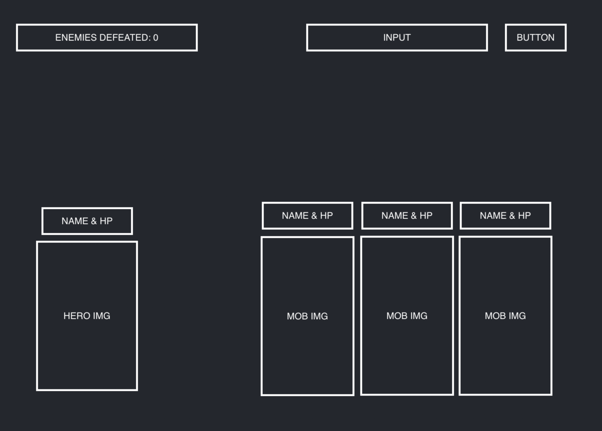

# HTML

-   hero section
    -   img
-   empty MOB section
-   input section
    -   name MOB
-   button
    -   add MOB
-   counter section

# DYNAMIC HTML

-   MOB elements to add to section
    -   img
    -   MOB name
    -   MOB HP

# STATE

-   New MOBS

-   HP

-   counter
